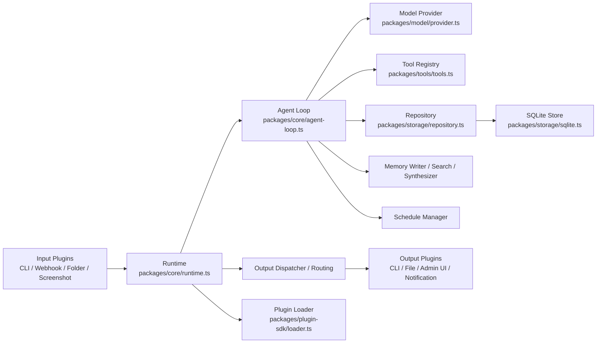
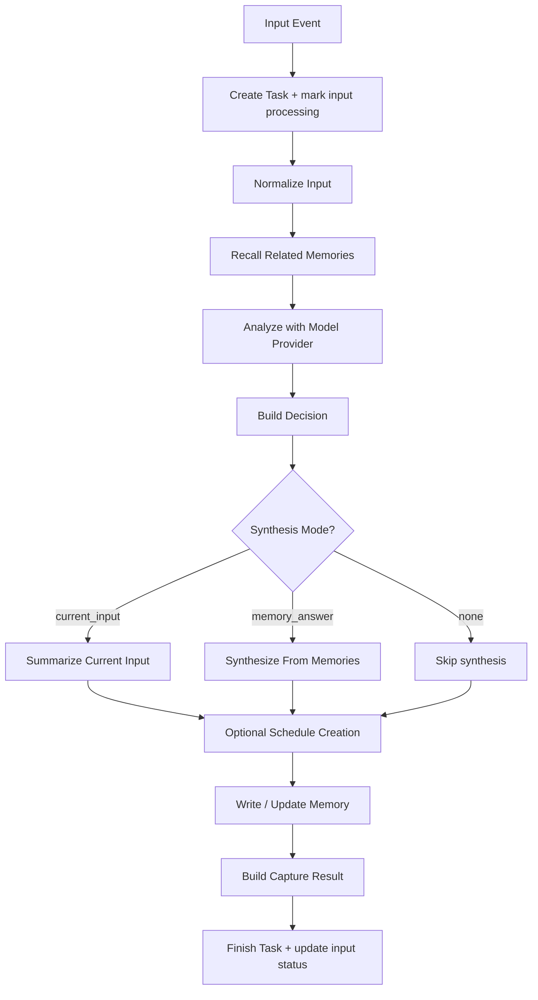
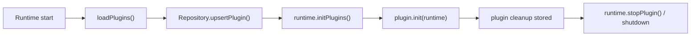
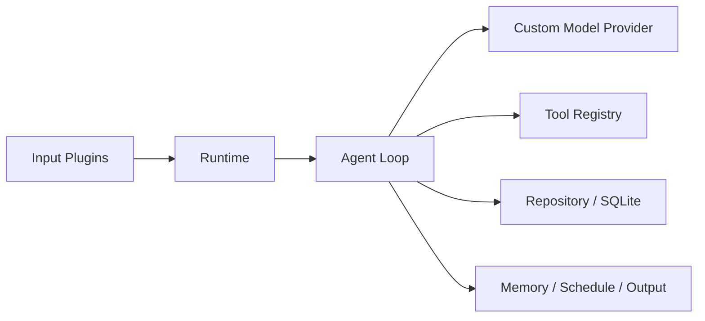
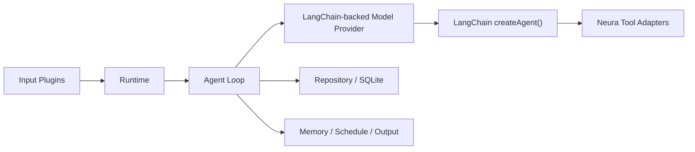
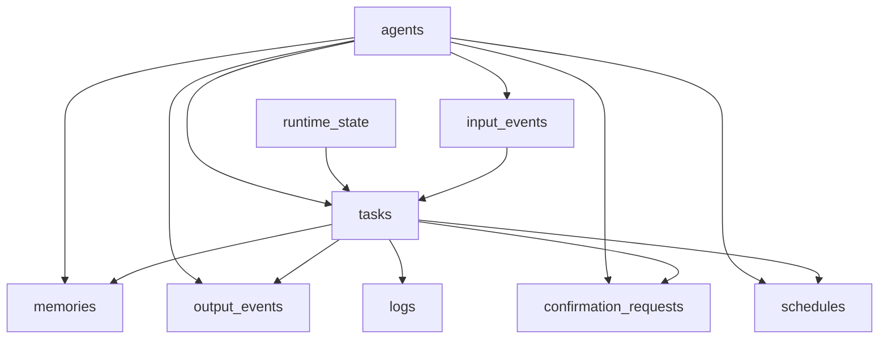

# Neura Project Architecture

## Goal

这份文档的目标只有一个：

- 让第一次接手 Neura 的人，能够在较短时间内完整理解项目的目标、模块边界、主流程、数据流和扩展点。

Neura 当前的核心定位是：

- 一个无 UI 优先、可常驻运行的个人智能体运行时
- 通过插件接收输入、调用模型分析、沉淀记忆、执行工具、路由输出
- 使用本地 SQLite 保存运行历史、记忆、审批、定时任务和日志

---

## 1. Project Snapshot

### 1.1 One-sentence Description

Neura 是一个“输入驱动型智能体运行时”，把来自 CLI、Webhook、文件夹、截图监听等来源的输入统一送入 Agent Loop，再决定是否写入记忆、是否创建提醒、是否需要输出、以及是否需要审批。

### 1.2 Core Closed Loop

```text
Input Plugin -> Runtime -> Agent Loop -> Memory / Schedule / Output -> Storage
```

### 1.3 Primary Value

- 把零散输入持续转成结构化记录
- 用本地记忆支持后续查询、总结、回顾
- 让高风险动作进入审批流
- 让提醒和周期检查进入调度系统

---

## 2. Directory Map

### 2.1 Top-level Structure

- `bin/`
  CLI 入口
- `apps/`
  常驻进程入口
- `packages/core/`
  运行时主流程和核心业务逻辑
- `packages/model/`
  模型 provider 抽象与具体实现
- `packages/storage/`
  SQLite 存储与 Repository
- `packages/tools/`
  工具调用与审批逻辑
- `packages/plugin-sdk/`
  插件发现与注册
- `packages/policy/`
  权限与确认策略
- `packages/memory/`
  记忆检索、相似度与向量逻辑
- `plugins/`
  输入/输出插件实现
- `docs/`
  文档与规划

### 2.2 High-value Files

- `bin/neura.ts`
  CLI 指令入口
- `apps/daemon/daemon.ts`
  常驻运行时主循环
- `packages/core/runtime.ts`
  系统装配中心
- `packages/core/agent-loop.ts`
  单次输入处理主链路
- `packages/storage/repository.ts`
  数据访问门面
- `packages/storage/sqlite.ts`
  SQLite 初始化与底层执行
- `packages/model/provider.ts`
  模型调用与结构化分析
- `packages/tools/tools.ts`
  工具执行与审批
- `neura.config.ts`
  运行配置

---

## 3. System Architecture



### 3.1 Layer Responsibilities

- 输入层：把外部事件变成统一输入
- Runtime 层：装配所有模块，管理插件与生命周期
- Agent Loop 层：处理一条输入的完整业务逻辑
- Model 层：生成结构化分析结果
- Tool 层：执行文件、命令、网络、二次模型调用等动作
- Memory / Schedule / Output 层：把分析结果落成后续行为
- Storage 层：把所有状态、历史和结果持久化

---

## 4. End-to-end Main Flow

Neura 最重要的主线是“处理一条输入”。建议按下面 8 个步骤理解。

### Step 1. Entry

输入可能来自：

- `bin/neura.ts` 的 `input` / `input-image`
- `apps/daemon/daemon.ts` 启动后的监听插件
- Webhook HTTP 请求
- 文件夹监听
- 截图监听
- 定时任务回放

这些输入最后都会走到：

- `runtime.input(...)`

### Step 2. Input Event Persistence

`runtime.input(...)` 会先在 Repository 中创建 `input_events` 记录，记录：

- 来源插件
- 输入类型
- 原始内容
- 元数据
- 当前状态

### Step 3. Agent Loop Dispatch

接着进入：

- `packages/core/agent-loop.ts`

这里是项目最核心的业务流程。

大体可以理解成 3 个阶段：

1. TaskSetup
2. Analyze
3. Persist

### Step 4. Normalize + Recall

Agent Loop 先做两件事：

- `input-normalizer.ts`
  把不同来源输入标准化成统一画像
- `repository.searchMemories(...)`
  召回相关历史记忆

标准化结果会得到：

- `scenario`
- `normalizedText`
- `keywords`
- `signals`
- `memorySearchQuery`
- `taskType`

### Step 5. Model Analysis

随后调用：

- `packages/model/provider.ts`

模型返回的是结构化分析，而不是一段自由文本。核心字段包括：

- `summary`
- `tags`
- `taskType`
- `category`
- `intent`
- `remembered`
- `memoryType`
- `importance`
- `confidence`
- `outputDecision`
- `extractedFacts`

如果启用了工具，模型还能在分析过程中调用：

- `search_memory`
- `read_file`
- `write_file`
- `delete_file`
- `execute_command`
- `call_model`
- `http_request`

### Step 6. Decision + Synthesis

模型分析完成后，进入：

- `decision-engine.ts`
- `result-synthesizer.ts`
- `reminder-intent.ts`

这一层负责把“分析结论”变成“系统动作”：

- 是否需要写记忆
- 是否应该总结当前输入
- 是否要用历史记忆回答问题
- 是否应该创建提醒
- 是否需要输出

### Step 7. Persist

Agent Loop 会把结果进一步落地到：

- `memory-writer.ts`
  写入或更新记忆
- `repository.createSchedule(...)`
  创建定时任务
- `capture-result.ts`
  形成可展示的 capture 结果
- `repository.finishTask(...)`
  结束任务

### Step 8. Output Routing

如果需要输出，会进入：

- `output-decision.ts`
- `output-routing.ts`
- `output-dispatcher.ts`

再由输出插件发送到：

- CLI
- 本地日志
- 系统通知
- 管理后台

---

## 5. Agent Loop Logic

下面是单条输入处理的更细粒度流程图。



### 5.1 Why Agent Loop Matters

如果你只能先看一个文件，优先看：

- `packages/core/agent-loop.ts`

因为它是整个项目“单次输入如何变成系统结果”的总编排器。

---

## 6. Runtime Lifecycle

Runtime 并不只是“处理输入”，它还负责装配和维护整个系统。

### 6.1 Startup Sequence

`createRuntime()` 的大致顺序是：

1. 读取环境变量
2. 初始化 SQLite
3. 创建 Repository
4. 确保默认 Agent 存在
5. 自动发现并加载插件
6. 创建权限策略
7. 创建模型 provider 工厂
8. 创建 OutputDispatcher
9. 创建 ToolRegistry
10. 创建 AgentLoop
11. 创建 ScheduleManager
12. 返回 runtime API

### 6.2 Daemon Loop

`apps/daemon/daemon.ts` 做的事情很少，但很关键：

- 调用 `createRuntime()`
- 标记 runtime 为 running
- 初始化插件
- 周期性发送 heartbeat
- 周期性处理到期 schedule
- 接收 stop request 或系统信号后优雅退出

---

## 7. Plugin Architecture

Neura 的输入和输出都通过插件扩展。

### 7.1 Plugin Loading

插件由：

- `packages/plugin-sdk/loader.ts`

自动扫描：

- `plugins/inputs/*`
- `plugins/outputs/*`

只要目录下存在：

- `plugin.ts`
- 或 `plugin.js`

就会被动态加载。

### 7.2 Plugin Shape

一个插件通常包含这些字段：

- `id`
- `name`
- `direction`
- `type`
- `init(runtime)` 或 `send(...)`

### 7.3 Input Plugins

当前主要输入插件：

- `cli-input`
- `webhook-input`
- `folder-watch-input`
- `screenshot-watch-input`

### 7.4 Output Plugins

当前主要输出插件：

- `cli-output`
- `local-log-output`
- `system-notification-output`
- `admin-ui-output`

### 7.5 Plugin Lifecycle



---

## 8. Model Architecture

模型层负责把输入转成结构化分析结果。

### 8.1 Provider Types

主要 provider 在：

- `packages/model/provider.ts`

当前支持：

- OpenAI-compatible
- DeepSeek
- Anthropic-compatible
- Mock provider

### 8.2 Model Output Philosophy

Neura 不是让模型只“写一句总结”，而是要求模型直接产出结构化字段，服务后续系统动作。

因此模型的职责是：

- 理解输入场景
- 判断长期价值
- 决定记忆策略
- 决定输出策略
- 提取事实
- 触发工具使用

### 8.3 Fallback Strategy

如果真实模型失败，系统尽量退回到：

- 本地启发式分析
- 本地 deterministic synthesis

目标是：

- 尽量完成任务，而不是整条输入失败

### 8.4 LangChain `createAgent()` Fit

这里的核心判断是：

- 适合局部引入
- 不适合直接替换整个 Neura Runtime

原因很简单。Neura 当前的核心价值并不只是“模型 + 工具循环”，而是一个完整的运行时系统，包含：

- 输入插件体系
- Agent Loop 编排
- Repository / SQLite 持久化
- 审批流
- Schedule 调度
- 输出路由
- 常驻 daemon 生命周期

LangChain 的 `createAgent()` 更适合承担的部分是：

- 模型推理循环
- 工具调用循环
- structured output
- streaming
- middleware
- human-in-the-loop

也就是说，`createAgent()` 更像是 Neura 中“模型决策内核”的候选实现，而不是整个 Neura 的替代品。

#### 8.4.1 Current Position

当前模型相关职责主要集中在：

- `packages/model/provider.ts`
- `packages/core/agent-loop.ts`
- `packages/tools/tools.ts`

其中：

- `provider.ts` 负责模型调用和工具循环
- `agent-loop.ts` 负责业务编排
- `tools.ts` 负责真实工具执行与审批

#### 8.4.2 Recommended Integration Point

推荐把 LangChain 放在 `Model Provider` 这一层，而不是 Runtime 最外层。

当前架构：



推荐的局部接入方式：



这个版本里：

- Runtime 不动
- Repository 不动
- Schedule / Output / Approval 不动
- 只替换模型分析和工具循环的实现内核

#### 8.4.3 Best Candidate Scenarios

最适合先尝试 LangChain `createAgent()` 的任务类型：

- `query`
- `memory_query`
- `action_request`
- `summarize_current`

这些任务有几个共同点：

- 需要工具循环
- 需要结构化结果
- 适合做 streaming
- 更接近 agent 范式

#### 8.4.4 Not Recommended for Full Replacement

不建议直接交给 `createAgent()` 的层：

- `packages/core/runtime.ts`
- `packages/storage/repository.ts`
- `packages/storage/sqlite.ts`
- `packages/core/schedule-manager.ts`
- `packages/core/output-routing.ts`
- `packages/core/output-dispatcher.ts`
- 插件加载与 daemon 生命周期

这些层本质上是“系统运行时基础设施”，不是 LangChain agent 的强项。

#### 8.4.5 Practical Migration Strategy

如果后续决定接入 LangChain，推荐按下面顺序推进：

1. 保留 `runtime.ts`、`agent-loop.ts`、`repository.ts` 不动
2. 在 `packages/model/` 新增一个 LangChain provider
3. 把现有 `ToolRegistry` 包一层 agent tool adapter
4. 先只接 `query` / `memory_query` 两类任务
5. 验证 structured output、tool calling、approval flow 是否仍能闭环
6. 再考虑扩展到 `summarize_current` 和更复杂任务

#### 8.4.6 Final Recommendation

如果目标是：

- 让模型工具循环更标准化
- 为后续 streaming / HITL / middleware 做准备

那么 LangChain `createAgent()` 是合适的。

如果目标是：

- 把整个 Neura 运行时迁移成 LangChain 风格

那么当前阶段不建议这么做。

---

## 9. Tool and Approval Architecture

工具系统在：

- `packages/tools/tools.ts`

### 9.1 Current Tool Capabilities

- 搜索记忆
- 读取文件
- 写入文件
- 删除文件
- 执行命令
- 二次调用模型
- 发起 HTTP 请求

### 9.2 Approval Rule

高风险动作不会直接执行，而是先进入审批：

- 覆盖文件
- 删除文件
- 执行命令

审批流会：

1. 创建 `confirmation_requests`
2. 创建一条审批任务
3. 按输出策略发送提醒
4. 等待用户 approve / reject

---

## 10. Memory Architecture

记忆相关逻辑主要分布在：

- `packages/memory/memory.ts`
- `packages/memory/langchain-memory.ts`
- `packages/core/memory-writer.ts`
- `packages/core/result-synthesizer.ts`
- `packages/storage/repository.ts`

### 10.1 Memory Write Path

写记忆时会做：

1. 生成 memory payload
2. 查找相似记忆
3. 视情况更新旧记忆或创建新记忆

### 10.2 Memory Read Path

读取记忆时主要发生在：

- Agent Loop 召回上下文
- review / search 命令
- 模型调用 `search_memory`
- memory answer synthesis

### 10.3 Memory Role in the System

记忆不是原始输入堆积，而是“长期价值的结构化沉淀”。

---

## 11. Schedule Architecture

定时系统涉及：

- `reminder-intent.ts`
- `schedule-manager.ts`
- `repository.ts`

### 11.1 Schedule Sources

定时任务可能来自：

- 用户明确创建 schedule
- 输入中被识别为 reminder intent

### 11.2 Schedule Execution

daemon 心跳时会：

1. 读取到期 schedule
2. 如果是 reminder，则直接走输出链路
3. 如果是 input，则重新构造成一条输入交给 runtime
4. 更新 `lastRunAt` / `nextRunAt` / `status`

---

## 12. Storage Architecture

底层存储是：

- `packages/storage/sqlite.ts`

数据访问门面是：

- `packages/storage/repository.ts`

### 12.1 Core Tables

- `agents`
- `plugins`
- `input_events`
- `tasks`
- `memories`
- `output_events`
- `tool_calls`
- `confirmation_requests`
- `schedules`
- `logs`
- `runtime_state`

### 12.2 Table Responsibilities

- `input_events`
  原始输入与处理状态
- `tasks`
  一次处理或系统动作的任务生命周期
- `memories`
  长期沉淀内容
- `output_events`
  输出发送记录
- `tool_calls`
  工具调用明细
- `confirmation_requests`
  高风险动作审批记录
- `schedules`
  定时任务
- `runtime_state`
  当前运行状态

### 12.3 Data Relationship



---

## 13. CLI and Operational View

### 13.1 CLI Role

`bin/neura.ts` 主要承担：

- 启停 daemon
- 发起输入
- 查看状态
- 浏览记录 / 记忆 / 任务 / 输出 / 审批 / 定时任务
- 触发 review

### 13.2 Daemon Role

`apps/daemon/daemon.ts` 主要承担：

- 常驻运行
- 插件生命周期管理
- 心跳
- 调度执行
- 停止流程

### 13.3 Common Usage Modes

- CLI 单次输入模式
- 常驻监听模式
- Webhook 接入模式
- Screenshot / Folder ingest 模式
- Reminder / scheduled review 模式

---

## 14. Recommended Reading Order

如果你想快速完全理解项目，建议按这个顺序读：

1. `README.md`
2. `neura.config.ts`
3. `packages/core/runtime.ts`
4. `packages/core/agent-loop.ts`
5. `packages/model/provider.ts`
6. `packages/tools/tools.ts`
7. `packages/storage/repository.ts`
8. `packages/storage/sqlite.ts`
9. `plugins/inputs/*`
10. `plugins/outputs/*`
11. `bin/neura.ts`
12. `apps/daemon/daemon.ts`

---

## 15. What Is Stable vs Evolving

### 15.1 Relatively Stable

- 输入插件 -> Runtime -> Agent Loop -> Repository 的整体主链路
- SQLite 作为本地存储
- 插件化输入输出机制
- 审批流和调度流的基本框架

### 15.2 Still Evolving

- 类型系统还在收敛中
- Runtime / Repository 接口边界仍在整理
- Model provider 抽象还可以继续正规化
- 管理端与 CLI 对 runtime 的外部契约还不够稳定

---

## 16. Current Improvement Priorities

基于当前代码状态，后续最值得继续做的方向是：

1. 给 `createRuntime()` 输出一个正式 `Runtime` 接口
2. 继续把 Repository 和 Store 层类型化
3. 收紧 model provider 的类结构和配置类型
4. 把 CLI / daemon 对 runtime 的访问改成强类型
5. 明确 plugin contract，减少隐式字段依赖

---

## 17. Final Summary

可以把 Neura 理解成三句话：

- 它是一个输入驱动的个人智能体运行时。
- 它的核心工作是把输入转成结构化分析，再决定记忆、提醒、输出和审批。
- 它的架构核心是 `runtime.ts` 负责装配，`agent-loop.ts` 负责单条输入处理，`repository.ts` 负责状态落盘，`plugins/` 负责扩展输入输出。

如果你后面要继续维护这个项目，最重要的两个抓手是：

- 主流程看 `packages/core/runtime.ts` 和 `packages/core/agent-loop.ts`
- 状态落地看 `packages/storage/repository.ts` 和 `packages/storage/sqlite.ts`
