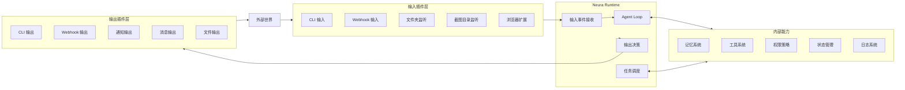

下面是重新整理后的 **Neura 需求文档**。

这版会完全按你现在确定的方向来写：

> **Neura 不是服务端软件，也不是桌面客户端，而是一个类似 OpenClaw 的常驻智能体运行时。**
> 它本身可以没有 UI，通过输入插件获取信息，通过输出插件表达信息，通过内部 Agent Loop 处理、记忆和决策。

---

# 一、需求文档大纲

## 1. 项目名称

定义 Neura 的名称、含义和一句话定位。

## 2. 项目背景

说明为什么需要一个常驻运行的个人智能体。

## 3. 产品定位

明确 Neura 是什么，不是什么。

## 4. 核心理念

定义 Neura 的核心模型：输入插件和输出插件是 Neura Runtime 面向外部世界的两个接口方向。

## 5. 核心名词定义

统一定义：

* Neura
* Runtime
* Agent Loop
* 输入插件
* 输出插件
* 工具
* 记忆
* 任务
* 状态
* 权限策略

## 6. 系统角色

定义系统使用者、插件、外部系统之间的关系。

## 7. 使用场景

描述 Neura 应该解决哪些具体问题。

## 8. 系统架构

描述 Neura Runtime、插件系统、记忆系统、工具系统、状态系统之间的关系。

## 9. 插件体系

明确插件只有两类：

* 输入插件
* 输出插件

工具不是第三类插件。

## 10. 功能需求

拆分 Neura 的核心功能：

* 常驻运行
* 输入接收
* 信息标准化
* Agent Loop
* 记忆系统
* 输出决策
* 插件管理
* 工具调用
* 权限策略
* 状态管理
* 日志记录

## 11. 核心流程

描述输入处理、记忆沉淀和输出表达三类核心流程。

## 12. 数据对象

定义 Agent、Plugin、InputEvent、Memory、Task、OutputEvent 等核心对象。

## 13. 技术方向

初步定义适合 Neura 的技术选型。

## 14. 推荐项目结构

描述适合 Neura 的初步代码组织方式。

## 15. 非功能需求

定义长期运行、可恢复、可扩展、可观测和安全要求。

## 16. 后续扩展方向

为未来插件、同步、多设备、自动化等能力预留空间。

---

# 二、Neura 需求文档 v0.2

# 1. 项目名称

## 1.1 名称

**Neura**

## 1.2 名称含义

Neura 来源于 **neural**，寓意系统像神经系统一样，能够接收信息、处理信息、形成记忆，并将结果传递出去。

## 1.3 一句话定位

**Neura 是一个无 UI 优先、长期运行的个人智能体运行时。**

它通过输入插件接收信息，通过 Agent Loop 理解和处理信息，通过记忆系统沉淀知识，并在必要时通过输出插件表达信息或触发动作。

---

# 2. 项目背景

用户每天都会接触大量信息：

```text
看到的网页
截图
收藏
临时想法
聊天内容
文件
代码片段
待办事项
灵感
```

传统笔记工具的问题是：

```text
需要用户主动整理
输入成本高
信息容易遗失
内容之间缺少关系
很多东西只是“看过”，但没有真正沉淀
```

Neura 希望解决的问题是：

> 用户不需要每次都打开一个复杂应用来记录信息。
> 用户只需要让信息进入 Neura，Neura 自动理解、整理、记忆，并在需要时表达出来。

Neura 的本体不应该是一个传统客户端，也不应该首先是一个服务端系统。

它应该是一个常驻运行的智能体内核。

---

# 3. 产品定位

## 3.1 Neura 是什么

Neura 是一个 **Agent Runtime**。

它是一个可以长期运行的智能体运行时，负责：

```text
接收输入
理解信息
沉淀记忆
构建上下文
调用工具
决定输出
记录状态
```

它可以运行在：

```text
个人电脑
服务器
NAS
VPS
本地开发环境
```

但它本身不依赖传统 UI。

## 3.2 Neura 不是什么

Neura 不是传统 Web 服务端。

Neura 不是传统桌面客户端。

Neura 不是笔记软件。

Neura 不是聊天机器人。

Neura 不是单纯的 API 服务。

Neura 的核心不是页面，而是：

```text
一个持续运行的智能体内核
```

---

# 4. 核心理念

Neura 的核心模型不是一条从输入到输出的流水线。

输入插件和输出插件是 Neura Runtime 面向外部世界的两个接口方向。

输入插件负责把外部信息送入 Neura。

输出插件负责把 Neura 需要表达的信息送出 Neura。

输入事件和输出事件没有一一对应关系，也不存在必然因果关系。

一次输入不一定产生输出。

一次输出也不一定来自某次输入。

Neura 的输入方向是：

```text
外部世界
↓
输入插件
↓
Neura Runtime
```

Neura 的输出方向是：

```text
Neura Runtime
↓
输出决策
↓
输出插件
↓
外部世界
```

Neura Runtime 内部的核心能力是：

```text
Agent Loop
↓
记忆 / 工具 / 策略 / 状态 / 日志
```

## 4.1 输入插件

负责把外部信息送进 Neura。

如果没有输入插件，Neura 无法获取新的信息。

## 4.2 Neura Runtime

负责运行智能体循环，处理输入事件，维护记忆、任务、状态和输出决策。

## 4.3 输出插件

负责把 Neura 的结果传递到外部。

如果没有输出插件，Neura 即使获得了知识，也无法表达出来。

---

# 5. 核心名词定义

## 5.1 Neura

Neura 是系统中的智能体本体。

它不是某个页面，也不是某个聊天窗口，而是一个常驻运行的智能体核心。

## 5.2 Runtime

Runtime 是 Neura 的运行时。

它负责启动、维持和调度 Neura 的核心能力。

Runtime 需要支持：

```text
启动
停止
重启
状态查看
插件加载
任务执行
日志记录
异常恢复
```

## 5.3 Agent Loop

Agent Loop 是 Neura 的智能体循环。

每当有输入事件进入，Neura 会执行一次处理流程：

```text
接收输入
↓
标准化信息
↓
召回相关记忆
↓
构建上下文
↓
判断长期价值
↓
调用必要工具
↓
生成记忆候选
↓
写入 / 更新 / 跳过记忆
↓
更新任务与状态
↓
记录日志
```

Agent Loop 可以改变 Neura 的内部状态。

输出由 Runtime 的输出决策机制独立判断，不是 Agent Loop 的必然结果。

Agent Loop 是 Neura 最核心的部分。

## 5.4 输入插件

输入插件负责让 Neura 获取外部信息。

输入插件只做一件事：

```text
把信息送进 Neura
```

例如：

```text
CLI 输入插件
Webhook 输入插件
截图目录监听插件
文件夹监听插件
浏览器扩展输入插件
消息输入插件
剪贴板输入插件
```

## 5.5 输出插件

输出插件负责让 Neura 表达信息或触发动作。

输出插件只做一件事：

```text
把 Neura 的结果送出去
```

例如：

```text
CLI 输出插件
Webhook 输出插件
通知输出插件
消息输出插件
邮件输出插件
文件输出插件
API 输出插件
```

## 5.6 工具

工具是 Neura 在处理过程中可以调用的能力。

例如：

```text
读取文件
写入文件
搜索记忆
调用模型
请求网页
执行命令
调用外部 API
生成摘要
提取文字
```

注意：

> 工具不是第三类插件。

插件只分为输入插件和输出插件。

工具属于 Neura 内部可调用能力。

## 5.7 记忆

记忆是 Neura 对信息处理后沉淀下来的长期上下文。

原始输入不等于记忆。

例如，用户输入：

```text
我想做一个像 OpenClaw 一样的无 UI 智能体运行时。
```

Neura 生成的记忆可能是：

```text
用户正在设计 Neura，一个无 UI 优先、常驻运行的个人智能体运行时，核心结构是输入插件、Agent Loop、记忆系统和输出插件。
```

## 5.8 任务

任务是 Neura 对一次输入或一次内部行为的处理单元。

例如：

```text
处理一条文本输入
分析一张截图
总结一个文件
写入一条记忆
触发一个输出插件
执行一次定时检查
```

## 5.9 状态

状态用于描述 Neura 当前是否正常运行。

例如：

```text
运行中
已停止
无输入插件
无输出插件
处理任务中
插件异常
工具调用失败
等待确认
```

## 5.10 权限策略

权限策略用于限制 Neura 能做什么，不能做什么。

例如：

```text
是否允许读取本地文件
是否允许执行命令
是否允许发送网络请求
是否允许调用输出插件
是否需要用户确认
```

---

# 6. 系统角色

## 6.1 用户

用户是 Neura 的拥有者。

用户可以：

```text
启动 Neura
停止 Neura
配置插件
输入信息
查看记忆
查看状态
查看日志
配置权限
```

## 6.2 输入插件

输入插件是信息来源。

它可以来自本地，也可以来自外部系统。

例如：

```text
命令行
Webhook
文件夹监听
截图监听
浏览器扩展
消息应用
```

## 6.3 输出插件

输出插件是结果出口。

它负责把 Neura 的处理结果传递给用户或其他系统。

## 6.4 工具

工具是 Neura 内部执行动作的能力。

工具可以被 Agent Loop 调用，但需要受到权限策略控制。

---

# 7. 核心使用场景

## 7.1 记录想法

用户通过 CLI 或其他输入插件发送一段想法给 Neura。

示例：

```bash
neura input "我想让 Neura 的插件只有输入和输出两类"
```

Neura 处理后：

```text
识别主题：Neura 插件系统
生成标签：智能体、插件、产品设计
写入记忆：用户希望 Neura 的插件体系保持极简，只分为输入插件和输出插件
```

---

## 7.2 接收 Webhook 信息

外部系统通过 Webhook 把信息传给 Neura。

例如：

```text
收藏了一个网页
某个系统产生了一条事件
某个自动化工具发送了一条内容
```

Neura 接收后自动分析、归类、记忆。

---

## 7.3 监听截图目录

输入插件监听某个截图目录。

当用户截图后，插件检测到新文件，并把图片交给 Neura。

Neura 可以：

```text
识别截图内容
提取文字
总结信息
判断是否值得保存
生成记忆
```

---

## 7.4 监听文件夹

用户把文件放进某个目录。

Neura 自动处理新文件。

例如：

```text
PDF
Markdown
TXT
图片
代码文件
```

Neura 可以读取内容、总结、打标签、存入记忆。

---

## 7.5 查询已有记忆

用户通过 CLI 查询 Neura 记忆。

示例：

```bash
neura memory search "插件系统"
```

Neura 返回相关记忆。

---

## 7.6 输出提醒

当 Neura 发现某条信息需要提醒用户时，可以通过输出插件发送通知。

例如：

```text
你最近一直在设计 Neura 的插件体系，当前已经确定插件只有输入和输出两类。
```

---

## 7.7 调用外部动作

Neura 在获得授权后，可以通过输出插件或工具调用外部系统。

例如：

```text
发送 Webhook
创建待办
写入文件
调用 API
发送消息
```

---

# 8. 系统架构

Neura 的整体架构如下。

输入插件和输出插件分别连接 Runtime，但它们不是同一条流水线的上下游。

```text
外部世界
↓
输入插件层
↓
Neura Runtime
↓
记忆系统 / 工具系统 / 权限策略 / 状态管理
↓
输出插件层
↓
外部世界
```

## 8.1 架构图



---

# 9. 插件体系

## 9.1 插件只有两类

Neura 的插件分类必须保持简单。

```text
输入插件
输出插件
```

不增加第三类插件。

## 9.2 输入插件定义

输入插件负责：

```text
监听外部信息
接收外部信息
转换为 Neura 输入事件
发送给 Neura Runtime
```

输入插件不负责：

```text
长期记忆
复杂推理
输出结果
调用高风险工具
```

## 9.3 输出插件定义

输出插件负责：

```text
接收 Neura 输出事件
转换为目标格式
发送到外部系统
记录输出结果
```

输出插件不负责：

```text
采集输入
构建上下文
决定是否记忆
复杂推理
```

## 9.4 同一个外部系统可以同时有输入和输出

例如消息应用：

```text
用户发消息给 Neura = 输入插件
Neura 回复用户 = 输出插件
```

概念上仍然拆分成两类能力。

不要把它定义成第三种插件。

---

# 10. 功能需求

# 10.1 Runtime 管理

## 功能说明

Neura 需要以常驻进程形式运行。

## 功能要求

需要支持：

```text
启动 Runtime
停止 Runtime
重启 Runtime
查看运行状态
查看运行时间
查看当前插件
查看最近任务
查看错误日志
```

## 示例命令

```bash
neura start
neura stop
neura restart
neura status
```

---

# 10.2 输入事件接收

## 功能说明

Neura 需要接收来自输入插件的事件。

## 输入事件类型

```text
text
image
file
url
event
command
```

## 输入事件字段

```text
id
sourcePluginId
type
content
metadata
createdAt
status
```

## 状态

```text
pending
processing
completed
failed
ignored
```

---

# 10.3 信息标准化

## 功能说明

不同输入插件传入的信息格式不同，Neura 需要转换为统一格式。

## 示例

CLI 输入：

```json
{
  "type": "text",
  "content": "我想设计 Neura 的插件系统",
  "source": "cli-input"
}
```

Webhook 输入：

```json
{
  "type": "event",
  "content": {
    "eventName": "bookmark_created",
    "url": "https://example.com"
  },
  "source": "webhook-input"
}
```

文件输入：

```json
{
  "type": "file",
  "content": {
    "path": "/data/inbox/example.md"
  },
  "source": "folder-watch-input"
}
```

---

# 10.4 Agent Loop

## 功能说明

Agent Loop 是 Neura 的核心处理流程。

每个输入事件进入后，都应该经过 Agent Loop。

## 处理流程

```text
接收输入事件
↓
标准化信息
↓
读取相关记忆
↓
构建上下文
↓
调用模型推理
↓
判断是否需要工具
↓
执行工具
↓
生成处理结果
↓
写入记忆
↓
决定是否输出
↓
记录日志
```

## Agent Loop 输出结果

一次 Agent Loop 结束后，至少应该产生：

```text
处理状态
摘要
标签
是否写入记忆
是否改变输出相关状态
错误信息
```

---

# 10.5 记忆系统

## 功能说明

Neura 需要把有长期价值的信息沉淀为记忆。

## 记忆类型

```text
用户想法
项目设定
产品决策
技术决策
偏好
知识片段
任务线索
上下文总结
```

## 记忆字段

```text
id
content
summary
tags
sourceInputId
importance
confidence
createdAt
updatedAt
```

## 记忆规则

Neura 不应该把所有输入都直接保存为记忆。

它需要判断：

```text
是否有长期价值
是否和已有记忆重复
是否应该更新已有记忆
是否只是临时信息
是否需要标记为重要
```

---

# 10.6 工具系统

## 功能说明

工具是 Neura 在推理过程中可以调用的能力。

## 基础工具

基础工具可以先支持：

```text
读取本地文件
写入本地文件
搜索记忆
调用模型
发送 HTTP 请求
```

## 工具调用限制

所有工具调用必须经过权限策略判断。

高风险工具默认不自动执行。

例如：

```text
执行 shell 命令
删除文件
发送邮件
调用支付接口
修改外部系统数据
```

这些必须经过用户确认或明确授权。

---

# 10.7 输出决策

## 功能说明

输出决策属于 Neura Runtime 的内部能力，和输入事件没有绑定关系。

Neura 可以在没有输入事件的情况下产生输出。

输入事件进入 Neura 后，也不一定产生输出。

输入事件可以改变 Neura 的内部状态、记忆或任务；这些变化可能间接影响未来是否需要输出，但输入事件本身不是输出事件的触发源。

Runtime 需要根据当前状态、任务、记忆、策略、权限和外部表达需求，独立判断是否需要产生 OutputEvent。

## 输出产生条件

```text
需要向用户表达结果
出现错误
需要用户确认
发现重要信息
定时任务触发
外部系统要求响应
状态变化需要通知
记忆回顾需要表达
```

## 输出内容类型

```text
回答
摘要
提醒
确认请求
执行结果
错误提示
状态报告
```

---

# 10.8 输出插件管理

## 功能说明

Neura 需要通过输出插件表达结果。

## 基础输出插件

基础输出插件可以支持：

```text
CLI 输出插件
Webhook 输出插件
本地日志输出插件
```

后续支持：

```text
通知输出插件
邮件输出插件
消息应用输出插件
文件输出插件
API 输出插件
```

---

# 10.9 插件管理

## 功能说明

Neura 需要能够加载、启用、禁用和查看插件。

## 插件字段

```text
id
name
direction
type
status
enabled
config
createdAt
updatedAt
```

其中：

```text
direction = input | output
```

## 插件状态

```text
enabled
disabled
running
error
waiting_config
```

## 示例命令

```bash
neura plugins list
neura plugins enable webhook-input
neura plugins disable folder-watch-input
```

---

# 10.10 状态管理

## 功能说明

Neura 必须清楚知道自己当前处于什么状态。

## 主要状态

```text
运行中
已停止
无输入插件
无输出插件
输入正常
输出正常
插件异常
任务失败
等待用户确认
```

## 四种连接状态

```text
有输入，有输出：完整运行状态
有输入，无输出：可以接收和记忆，但无法表达
无输入，有输出：只能表达已有知识，无法获取新信息
无输入，无输出：孤立运行状态
```

---

# 10.11 日志系统

## 功能说明

Neura 需要记录关键行为，方便追踪和调试。

## 日志类型

```text
runtime 日志
输入日志
任务日志
模型调用日志
工具调用日志
记忆写入日志
输出日志
错误日志
```

## 日志字段

```text
id
level
type
message
metadata
createdAt
```

---

# 10.12 权限策略

## 功能说明

Neura 需要有权限边界。

不能因为它是智能体，就默认什么都能做。

## 权限类型

```text
文件读取权限
文件写入权限
网络请求权限
命令执行权限
输出发送权限
工具调用权限
插件访问权限
```

## 高风险动作

以下动作默认需要确认：

```text
执行 shell 命令
删除文件
覆盖文件
发送邮件
向外部系统写入数据
调用支付相关接口
访问敏感目录
```

---

# 11. 核心流程

## 11.1 输入处理流程

```text
外部信息
↓
输入插件
↓
InputEvent
↓
Neura Runtime
↓
Agent Loop
↓
记忆 / 状态 / 日志
```

## 11.2 记忆沉淀流程

```text
标准化信息
↓
召回相关记忆
↓
判断长期价值
↓
生成记忆候选
↓
创建 / 更新 / 跳过记忆
↓
记录记忆结果
```

## 11.3 输出表达流程

```text
Neura Runtime 内部状态 / 任务 / 记忆 / 策略
↓
输出决策
↓
OutputEvent
↓
输出插件
↓
外部世界
```

## 11.4 CLI 输入示例

```text
用户输入命令
↓
CLI 输入插件生成 InputEvent
↓
Neura Runtime 接收事件
↓
Agent Loop 处理
↓
写入记忆 / 更新状态 / 记录日志
```

CLI 输入可能只沉淀记忆。

如果 Runtime 另行判断需要表达，才会产生 OutputEvent。

---

# 12. 数据对象设计

## 12.1 Agent

表示 Neura 智能体。

```text
id
name
status
createdAt
updatedAt
```

## 12.2 Plugin

表示插件。

```text
id
name
direction
type
status
enabled
config
createdAt
updatedAt
```

其中：

```text
direction = input | output
```

## 12.3 InputEvent

表示一次输入事件。

```text
id
pluginId
type
content
metadata
status
createdAt
processedAt
```

## 12.4 Task

表示一次处理任务。

```text
id
sourceType
sourceId
type
status
result
error
createdAt
finishedAt
```

其中：

```text
sourceType = input_event | schedule | runtime_state | approval | memory_review | manual | internal
sourceId = 对应来源 ID，可为空
```

Task 可以来自 InputEvent，也可以来自 Runtime 内部行为。

## 12.5 Memory

表示一条记忆。

```text
id
content
summary
tags
sourceInputId
importance
confidence
createdAt
updatedAt
```

## 12.6 OutputEvent

表示一次输出事件。

```text
id
pluginId
sourceType
sourceId
type
content
status
createdAt
sentAt
```

其中：

```text
sourceType = runtime_state | schedule | memory_review | approval | manual | input_event | task
sourceId = 对应来源 ID，可为空
```

OutputEvent 不必须关联 InputEvent。

## 12.7 ToolCall

表示一次工具调用。

```text
id
toolName
input
output
status
riskLevel
createdAt
finishedAt
```

## 12.8 Log

表示一条日志。

```text
id
level
type
message
metadata
createdAt
```

---

# 13. 技术方向

## 13.1 推荐技术栈

```text
语言：TypeScript
运行时：Bun
存储：SQLite
CLI：Commander / CAC
配置：neura.config.ts
模型：远程模型 API 优先
插件：本地插件目录
部署：单机常驻进程
```

## 13.2 为什么适合 Bun

Neura 不是传统服务端，而是一个运行时。

Bun 适合承担：

```text
运行 TypeScript
启动 Runtime
执行 CLI
加载插件
处理任务
读写本地文件
调用模型 API
```

## 13.3 当前阶段暂不需要的技术

当前阶段暂时不需要：

```text
PostgreSQL
Redis
BullMQ
Docker Compose
NestJS
Next.js
Tauri
Electron
Kubernetes
```

这些不是不能用，而是现在会让系统变重。

---

# 14. 推荐项目结构

```text
neura/
├── apps/
│   ├── daemon/                 # Neura 常驻运行时
│   └── cli/                    # 命令行入口
│
├── packages/
│   ├── core/                   # Agent Loop 核心逻辑
│   ├── memory/                 # 记忆系统
│   ├── storage/                # SQLite 存储
│   ├── plugin-sdk/             # 插件协议
│   ├── tools/                  # 工具系统
│   ├── policy/                 # 权限策略
│   └── shared/                 # 公共类型
│
├── plugins/
│   ├── inputs/
│   │   ├── cli-input/
│   │   ├── webhook-input/
│   │   └── folder-watch-input/
│   │
│   └── outputs/
│       ├── cli-output/
│       ├── webhook-output/
│       └── file-output/
│
├── data/
│   ├── neura.db
│   └── files/
│
├── logs/
│   └── neura.log
│
├── neura.config.ts
├── package.json
└── bun.lock
```

# 15. 非功能需求

## 15.1 长期运行

Neura 应该适合长期运行。

单次任务失败不能导致整个 Runtime 崩溃。

## 15.2 可恢复

Runtime 异常退出后，再次启动时可以恢复状态。

## 15.3 可扩展

后续可以增加新的输入插件和输出插件。

## 15.4 可观测

用户可以看到：

```text
当前状态
最近输入
最近任务
错误日志
插件状态
```

## 15.5 安全

Neura 不能默认拥有全部权限。

高风险工具调用必须受控。

---

# 16. 后续扩展方向

## 16.1 Webhook 输入插件

允许外部系统通过 HTTP 把事件发送给 Neura。

## 16.2 文件夹监听输入插件

监听指定目录，自动处理新文件。

## 16.3 截图监听输入插件

监听截图目录，自动分析截图内容。

## 16.4 浏览器扩展输入插件

用户可以把当前网页发送给 Neura。

## 16.5 消息应用输入输出插件

通过 Telegram、Discord、微信等消息工具和 Neura 交互。

## 16.6 通知输出插件

Neura 可以主动向用户发送提醒。

## 16.7 自动化输出插件

Neura 可以在授权后触发外部自动化流程。

## 16.8 多设备同步

未来可以加入云端同步，但不是 Neura 本体的一部分。

## 16.9 插件市场

未来可以提供插件安装和分发能力。

---

# 17. 最终定义

Neura 的最终产品定义可以写成：

> **Neura 是一个无 UI 优先的个人智能体运行时。它以常驻进程的形式运行，通过输入插件接收信息，通过 Agent Loop 理解、处理并沉淀记忆，并在必要时通过输出插件表达信息或触发动作。**

更短一点：

> **Neura 是一个长期运行的个人智能体内核。**

核心模型是：

```text
外部世界
↓
输入插件
↓
Neura Runtime
↓
Agent Loop
↓
记忆 / 工具 / 策略
```

以及：

```text
Neura Runtime
↓
输出决策
↓
输出插件
↓
外部世界
```

最重要的产品原则是：

```text
Neura 的本体是 Runtime，不是 UI。
插件只有两类：输入插件和输出插件。
工具不是插件，而是 Neura 内部可调用能力。
服务端、客户端、Web 页面都只是未来的外围能力，不是 Neura 的核心。
```
